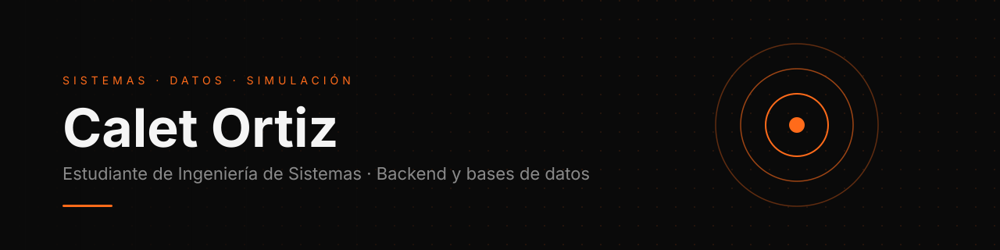

 

[Portafolio](#) &nbsp;·&nbsp; [LinkedIn](www.linkedin.com/in/calet-ortiz-0bab62394) &nbsp;·&nbsp; [Correo](mailto:ortizcalet2@gmail.com)

 

## Sobre mí

Estudiante de Ingeniería de Sistemas en Valledupar, Colombia.
Me enfoco en **backend**, **bases de datos** y **simulación física**.
Además trabajo como desarrollador web freelance.

 

## Stack

**Datos** &nbsp;

**Lenguajes** &nbsp;

**Gráficos y simulación** &nbsp;

**Infraestructura** &nbsp;

 

## Proyectos

| Proyecto | Qué es |
|:--|:--|
| [**sql-datawarehouse-project**](https://github.com/CaletOrtiz/sql-datawarehouse-project) | Data warehouse sobre TPC-H con arquitectura Medallón y modelo en estrella |
| [**Simulaciones físicas**](#) | Simulaciones en C++ y OpenGL |

 

## En números

